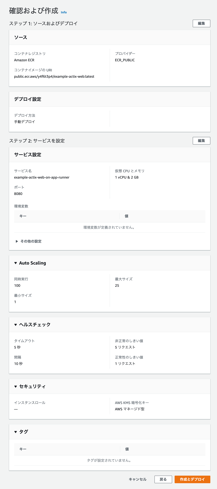

# App Runner Setup

## Setting



## Log

```
06-15-2021 04:56 AM [AppRunner] Service status is set to RUNNING.
06-15-2021 04:56 AM [AppRunner] Service creation completed successfully.
06-15-2021 04:56 AM [AppRunner] Successfully routed incoming traffic to application.
06-15-2021 04:55 AM [AppRunner] Health check is successful. Routing traffic to application.
06-15-2021 04:55 AM [AppRunner] Performing health check on path '/' and port '8080'.
06-15-2021 04:55 AM [AppRunner] Provisioning instance and deploying image.
06-15-2021 04:55 AM [AppRunner] Successfully pulled image from ECR.
06-15-2021 04:53 AM [AppRunner] Service status is set to OPERATION_IN_PROGRESS.
06-15-2021 04:53 AM [AppRunner] Service creation started.
```

## Test by cURL

```bash
$ curl https://mhpr2ckngp.us-east-1.awsapprunner.com/
Hello Actix-Web!
```
